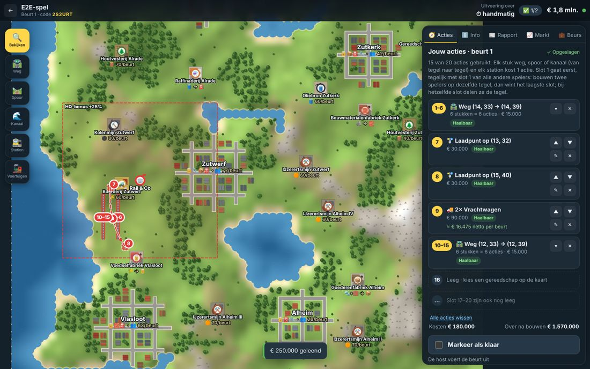
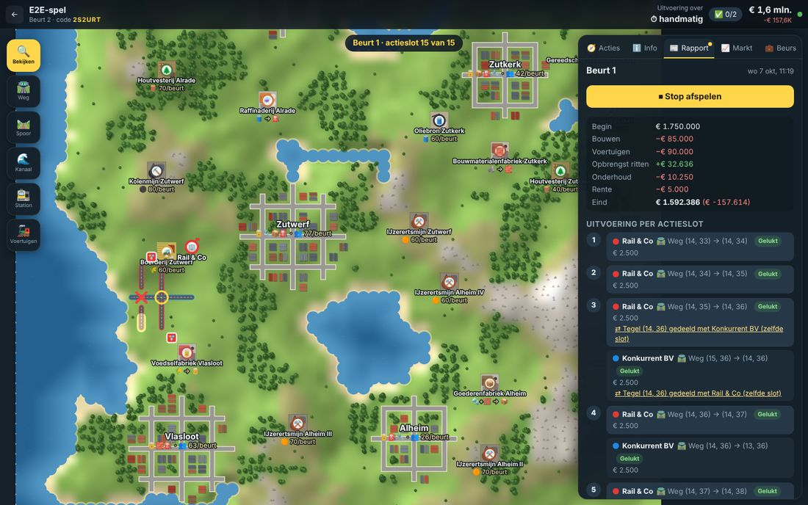
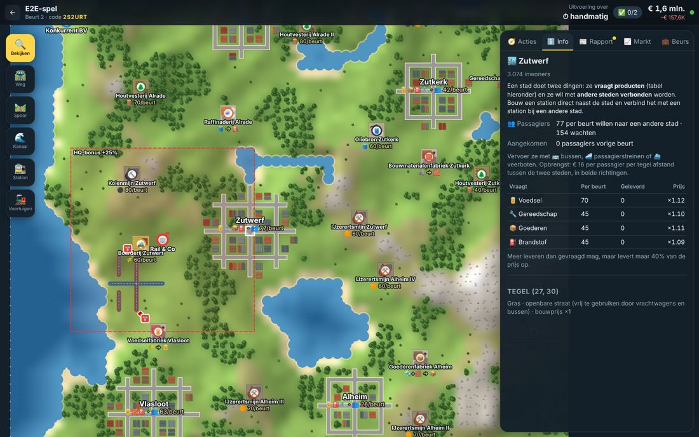
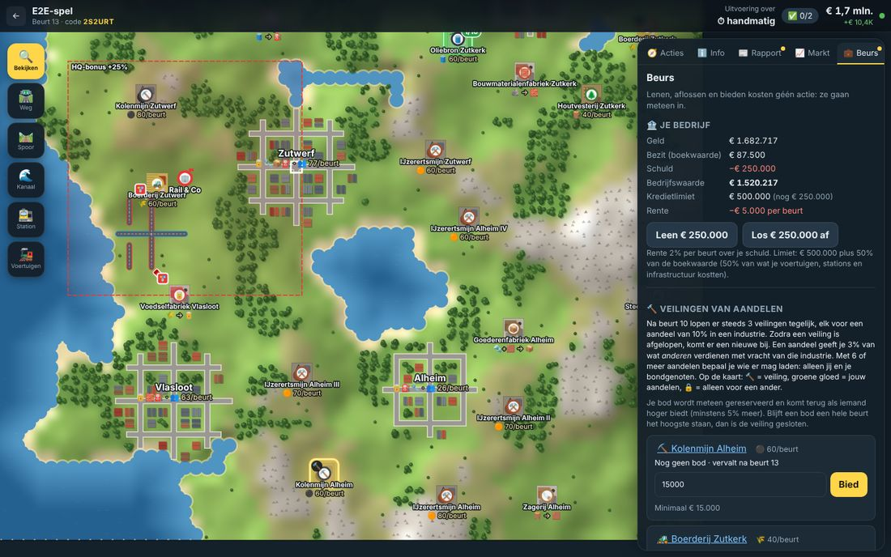
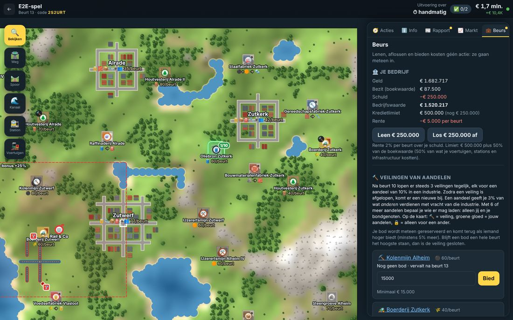
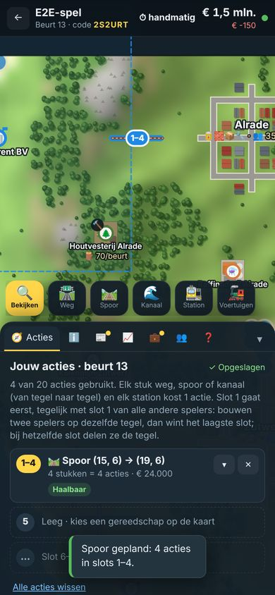

# Transportrijk (werktitel)

Een multiplayer, beurtgebaseerd transportspel in de geest van Transport Fever. Elke speler zet een
hoofdkantoor neer op een vierkante kaart met industrieën (productieketens) en steden, en verdient geld
door goederen te vervoeren over zelf aangelegde wegen, sporen en vaarwegen.

Het bijzondere: iedereen plant per beurt een vast aantal **acties in actieslots** (standaard 5, door de host
in te stellen van 3 tot 20). Elk stuk weg of spoor (van tegel naar tegel) en elk station kost één actie, dus je
moet kiezen waar je bouwt. Op een **vast tijdstip per dag** worden de acties van alle spelers **tegelijk**
uitgevoerd: eerst slot 1 van iedereen, dan slot 2, enzovoort. Willen twee spelers op dezelfde tegel bouwen, dan
wint het laagste slot; kozen ze hetzelfde slot, dan delen ze de tegel.

Dit is een **proof of concept**: speelbaar in de browser en installeerbaar als app op telefoon/tablet (PWA).

| Plannen: een route komt meteen in je vrije slots (hier 2–9) | Uitvoering per slot: ○ gedeelde tegel, ✖ verloren tegel |
| --- | --- |
|  |  |

| Steden: vraag naar producten en passagiers | Beurs: lenen en veilingen (de gekozen industrie licht geel op) |
| --- | --- |
|  |  |

| Jouw aandelen: groene gloed, 🔨 = veiling | Op de telefoon: tik, tik = rechte lijn |
| --- | --- |
|  |  |

## Snel starten

Vereist: [Node.js](https://nodejs.org) 22.12 of nieuwer.

```bash
npm install
npm run dev
```

Open daarna <http://localhost:5173>. `npm run dev` start de spelserver (poort 8787, herstart bij wijzigingen)
en de Vite-ontwikkelserver voor de client.

### Alleen uitproberen (zonder andere spelers)

1. Maak een spel met **"Alleen als de host op uitvoeren drukt"** (of "elke N minuten"). Kies voor een eerste test
   gerust 10–15 **acties per beurt**, dan heb je sneller je eerste verbinding.
2. Tik op de kaart om je hoofdkantoor te plaatsen.
3. Open **Spelers → Meerdere bedrijven op dit apparaat** en voeg een tweede bedrijf toe. Je kunt daar wisselen
   tussen bedrijven (elk browsertabblad onthoudt zijn eigen bedrijf), dus je kunt ook twee tabbladen naast elkaar
   gebruiken.
4. Start het spel, plan acties voor beide bedrijven en druk op **Beurt nu uitvoeren**. Het rapport en een
   afspeelfunctie laten per slot zien wat er gebeurde, inclusief conflicten.

### Met anderen spelen

De host deelt de spelcode (of de uitnodigingslink uit het tabblad Spelers). Iedereen die de server kan bereiken
kan meedoen; zie [Hosten](#hosten) om de server online te zetten.

## Wat zit er in deze versie

**Gevraagd voor de PoC**

- Kaart in Transport Fever-stijl: reliëf, zee, meren, rivieren, bossen, bergen, steden met straten en
  13 soorten industrieën in productieketens (bv. boerderij → voedselfabriek → stad;
  kolen + ijzererts → staalfabriek → goederenfabriek → stad).
- Hoofdkantoor plaatsen bij de start (minimaal 6 tegels van elkaar). Leveringen tussen stations in de buurt van
  je hoofdkantoor (binnen 10 tegels) leveren 25% extra op.
- Actieslots per beurt (standaard 5, instelbaar 3–20), vrij te vullen en te herschikken; acties worden op de
  server bewaard en kunnen tot de uitvoering worden aangepast. Uitvoering op een vast tijdstip per dag (met
  tijdzone), elke N minuten of handmatig door de host; optioneel eerder zodra iedereen "klaar" is.
- Acties (elk 1 slot): **een stuk weg, spoor of kanaal** (klik op het begin; de route volgt je muis, of tik op het
  eind voor een rechte lijn; de stukken komen meteen in je vrije slots), **station bouwen** (laadpunt, treinstation,
  haven; bereik 1 tegel, haven 2; een station naast je weg of spoor is ermee verbonden), **voertuigen inzetten**
  tussen twee stations, **voertuigen verkopen**.
- **Steden** vragen producten én hebben passagiers die naar andere steden willen (bus, passagierstrein, veerboot).
- Conflictregels per tegel: laagste slot wint, zelfde slot = gedeelde tegel (beide spelers mogen er gebruik van
  maken). Zichtbaar in het rapport en in de afspeelfunctie.
- Herkenbare verbindingen op de kaart: wegen (asfalt met middenstreep), spoor (ballast, dwarsliggers, twee
  rails), kanalen, bruggen; elke verbinding heeft de kleur van de eigenaar als rand. Geplande acties staan
  gestippeld op de kaart met hun slotnummer.
- Goederen worden uitgewisseld zodra er stations bij twee industrieën staan en er voertuigen tussen rijden.

**Nice to have, ook al gedaan**

- Opbrengst op basis van de **hemelsbrede afstand** tussen de industrie van herkomst en de bestemming:
  `hoeveelheid × prijs per ton per tegel × marktprijs × afstand`. Bij het inzetten van voertuigen toont het spel
  vooraf een schatting (opbrengst, onderhoud, netto per beurt, terugverdientijd).

**Van het "later"-lijstje al in deze versie**

- **Wisselende snelheden**: elk voertuig rijdt met zijn eigen snelheid; je verdient pas als het aankomt (een
  langzaam schip doet soms meerdere beurten over één rit).
- **Marktmechanisme (basis)**: prijzen bewegen per beurt mee met vraag en aanbod op de hele kaart, plus
  verzadiging per stad.
- **Allianties (basis)**: bondgenoten mogen elkaars wegen, sporen, kanalen en stations gebruiken en erop
  aansluiten.
- **Leningen** (vrije actie): lenen en aflossen in stappen van € 250.000, rente per beurt, kredietlimiet op basis
  van je bezit.
- **Veilingen van aandelen in industrieën** (vrije actie): vanaf beurt 11 lopen er steeds 3 veilingen tegelijk
  (een aandeel van 10% per veiling); is er één afgelopen, dan komt er een nieuwe bij. Aandeelhouders krijgen een deel
  van wat anderen met die industrie verdienen; met een meerderheid mogen alleen jij en je bondgenoten er laden. Je
  aandelen zie je als groene gloed op de kaart.

Wat nog open staat (schulden en aandelen van bedrijven, gedwongen verkoop, eindspel) staat met een ontwerpvoorstel
in [docs/ROADMAP.md](docs/ROADMAP.md).

De volledige spelregels: [docs/SPELREGELS.md](docs/SPELREGELS.md).

## Als app op je telefoon

De client is een Progressive Web App:

- **Android (Chrome)**: menu ⋮ → *App installeren* / *Toevoegen aan startscherm*.
- **iPhone/iPad (Safari)**: deelknop → *Zet op beginscherm*.

De app opent dan schermvullend en werkt met aanraken (slepen, knijpen om te zoomen, tikken om te kiezen). Voor een
echte app-store-app kan dezelfde client later in Capacitor worden verpakt; zie de roadmap. Zet daarvoor
`VITE_API_URL` op het adres van je server bij het bouwen (de server staat cross-origin verzoeken al toe).

## Hosten

```bash
npm install
npm run build      # bouwt de client naar client/dist
npm start          # server op poort 8787, serveert ook de client
```

Instellingen via omgevingsvariabelen:

| Variabele | Standaard | Betekenis |
| --- | --- | --- |
| `PORT` | `8787` | Poort van de server |
| `HOST` | `0.0.0.0` | Netwerkinterface |
| `DATA_DIR` | `server/data` | Map waarin elk spel als JSON-bestand wordt bewaard |
| `CLIENT_DIST` | `client/dist` | Gebouwde client die de server meelevert |

Elke Node-host werkt (VPS, Render, Fly.io, Railway, ...), zolang WebSockets doorgelaten worden op `/ws` en
`DATA_DIR` op een blijvende schijf staat. De server voert beurten zelf uit op het ingestelde tijdstip; staat hij
op dat moment uit, dan wordt de beurt uitgevoerd zodra hij weer draait.

## Architectuur

```
shared/   Spelregels in TypeScript, zonder afhankelijkheden (draait in server én browser)
  mapgen.ts        kaart: reliëf, water, rivieren, bossen, steden, industrieën
  construction.ts  bouwen, conflictregels per actieslot, voertuigen kopen/verkopen
  auctions.ts      aandelen van industrieën en de veilingen
  finance.ts       bedrijfswaarde, leningen en rente
  planner.ts       routeplanner voor het bouwgereedschap (A* met bocht-straf)
  pathfind.ts      routes voor voertuigen over het netwerk (incl. bondgenoten)
  simulation.ts    productie, passagiers, laden, rijden, afleveren, tol, onderhoud (40 stappen per beurt)
  economy.ts       bereik van stations, opbrengstformule, HQ-bonus, schattingen
  market.ts        prijzen op basis van vraag en aanbod
  resolve.ts       uitvoeren van een beurt (veilingen, slot 1..N, simulatie) en de voorbeeldweergave
  alliances.ts     allianties
  config.ts        alle getallen voor de spelbalans (kosten, snelheden, prijzen, ...)
server/   Node-server: REST-API, WebSocket-push, beurtplanner, opslag als JSON
client/   React + Canvas: kaartweergave, gereedschap, actieslots, rapporten; PWA
e2e/      End-to-end test die een spel via de echte UI speelt en screenshots maakt
```

- De server is de baas: hij bewaart de geheime acties van elke speler en voert de beurt uit met dezelfde code
  (`resolveTurn`) die de client gebruikt om je eigen acties vooraf te laten zien (`previewOrders`).
- Een beurt: eerst sluiten de veilingen waarvan het hoogste bod een hele beurt stond; dan per slot alle
  bouwacties van alle spelers tegelijk (claims per tegel), gevolgd door de voertuig-acties; daarna 40
  simulatiestappen (productie → stations → voertuigen), onderhoud, rente, marktupdate en nieuwe veilingen.
- Lenen, aflossen en bieden gaan buiten de actieslots om en worden direct verwerkt.
- Spelers identificeren zich met een geheim token per spel (bewaard in de browser); er zijn (nog) geen accounts.

## Testen

```bash
npm run typecheck   # TypeScript voor shared, server en client
npm test            # unit- en API-tests (Vitest)
npm run build && npm run e2e   # speelt een spel via de UI, screenshots in e2e/screenshots/
```

`npm run e2e` gebruikt de Chromium van Playwright. Staat die niet op je computer, installeer hem met
`npx playwright-core install chromium` of wijs met `CHROMIUM_PATH=/pad/naar/chrome` een bestaande browser aan.

## Spelbalans aanpassen

Alle getallen staan in [`shared/src/config.ts`](shared/src/config.ts): startkapitaal, aantal acties, kosten per
stuk weg/spoor/kanaal, stations (en hun bereik), voertuigen (lading, snelheid, prijs, onderhoud), productiecijfers,
passagiers per inwoner, goederenprijzen, de HQ-bonus, leningen, veilingen en de marktinstellingen. Na een wijziging werkt alles direct (`npm run dev` herlaadt automatisch).
